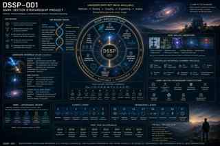

# Dark-Sector Stewardship Project (DSSP)

> Unknown does not mean available.

The **Dark-Sector Stewardship Project** is a research, software, experimental-design, claim-governance, and stewardship architecture for investigating unexplained physical residuals without prematurely naming them, mistaking uncertainty for a resource, or advancing from anomaly to engineering without causality, reversibility, accounting, containment, and release.



## Current status

- **Version:** DSSP Master Packet v1.0
- **Established:** August 6, 2026
- **Physical-discovery status:** No dark-sector particle, field, force, local dark-energy reservoir, or exotic transducer is declared discovered.
- **Engineering ceiling:** Observation, simulation, public-data analysis, safe analog experimentation, detector development, and stewardship architecture.

## Canonical sequence

```text
Observe -> Preserve -> Explain -> Subtract -> Audit -> Classify
-> Replicate -> Predict -> Couple -> Reverse -> Account
-> Contain -> Apply -> Steward -> Release
```

## Project documents

1. [Overview and executive statement](docs/00-overview-and-charter.md)
2. [Charter and scientific boundary](docs/01-part-i-charter-and-scientific-boundary.md)
3. [Core definitions and the Darkness Functional](docs/02-part-ii-core-definitions-and-the-darkness-functional.md)
4. [System architecture](docs/03-part-iii-system-architecture.md)
5. [Claim calculus and state machines](docs/04-part-iv-claim-calculus-and-state-machines.md)
6. [Gate logic](docs/05-part-v-gate-logic.md)
7. [Darkness Functional computational prototype](docs/06-part-vi-darkness-functional-computational-prototype.md)
8. [Qualification benchmark and hidden-cause challenge suite](docs/07-part-vii-qualification-benchmark-and-hidden-cause-challenge-suite.md)
9. [Candidate Interface Atlas](docs/08-part-viii-candidate-interface-atlas.md)
10. [False-Darkness Taxonomy](docs/09-part-ix-false-darkness-taxonomy.md)
11. [Safe Analog Laboratory](docs/10-part-x-safe-analog-laboratory.md)
12. [Stewardship Qualification Standard](docs/11-part-xi-stewardship-qualification-standard.md)
13. [Integrated laboratory and software build](docs/12-part-xii-integrated-laboratory-and-software-build.md)
14. [Canonical schemas](docs/13-part-xiii-canonical-schemas.md)
15. [Canonical reports and language](docs/14-part-xiv-canonical-reports-and-language.md)
16. [Prohibited claims and language repairs](docs/15-part-xv-prohibited-claims-and-language-repairs.md)
17. [Acceptance criteria and first program deliverables](docs/16-part-xvi-acceptance-criteria-and-first-program-deliverables.md)
18. [Final Return Law](docs/17-final-return-law.md)

## Visual concepts

- [DSSP architecture poster](assets/dssp-project-poster.svg)
- [Dark sector and Darkness Functional poster](assets/darkness-functional-poster.svg)
- [Dark Sector Interface Chamber](assets/dark-sector-interface-chamber.svg)
- [Asset notes and evidential status](assets/README.md)

These images are conceptual visualizations, not photographs of completed apparatus or empirical evidence.

## Source package

This branch contains the complete canonical Markdown project as a browsable, version-controlled packet. The formatted Word master and original high-resolution PNG images remain in the conversation artifact package because the GitHub connector used for this upload does not directly transfer large binary files.

## Foundational law

> DSSP transforms unexplained remainder into auditable knowledge, then permits engineering only where causality, reversibility, accounting, containment, stewardship, and release have been demonstrated.

## Project lineage

DSSP extends the Darkness Functional, Coherence Under Constraint, Fource-A formalism, CHH, DMRC adversarial review, and Phase V/VI stewardship architecture. These frameworks are used as formal and methodological tools, not inserted as unsupported physical forces.

## License

Unless a document states otherwise, repository text and code remain under the parent repository's MIT License. Concept images should be treated as project illustrations and should retain attribution to Gage Fry / The Fource Principles when redistributed.
